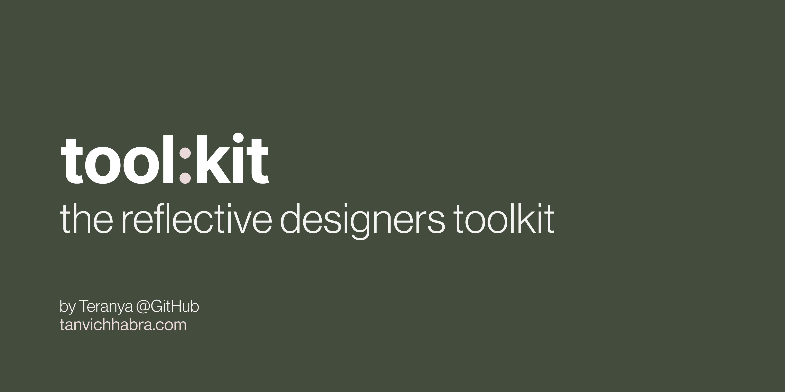

# tool:kit

   

tool:kit is a design reflection toolkit made for design students. This repo's where I'm storing (and probably hosting) the product website.

## The website
[live site here](https://teranya.github.io/toolkit/)
